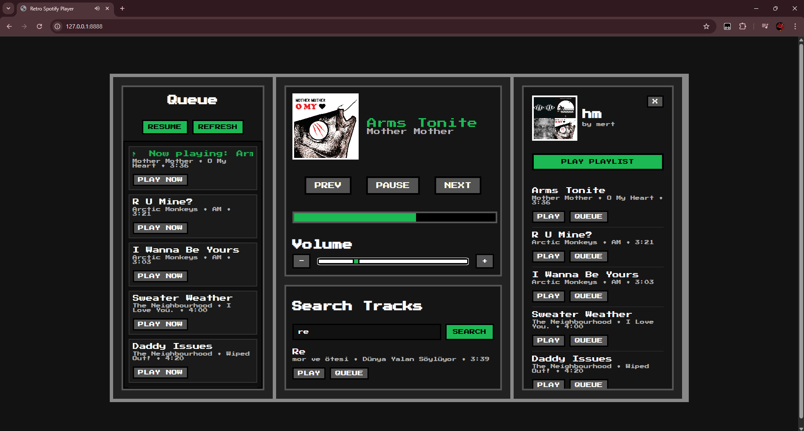
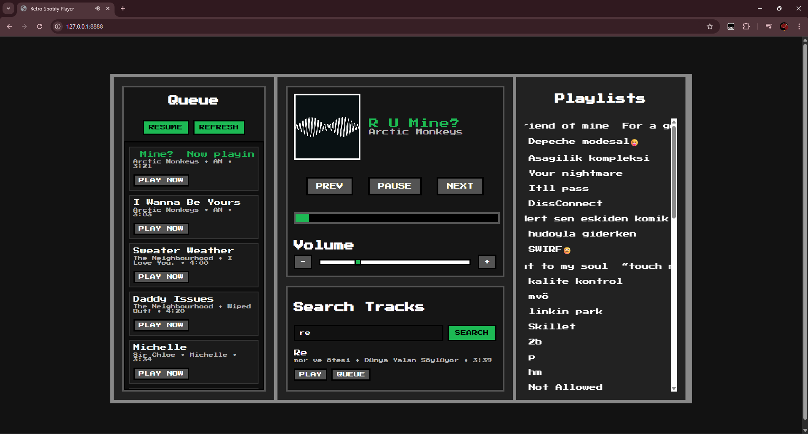

# Retro Spotify Player

## About
I just wanted to make a player that i would use for its appearance. It's still in development and not an application right now. It can be run from chrome based browsers, i dont really know why firefox based browsers they just doesnt work because of the DRM protections but there is nothing wrong with it actually. Last thing its too much spagetti for now and probably clean it on the next commit! 


## Setup

1. Install dependencies:
```bash
npm install
```

2. Ensure `.env` exists in the project root with:
```bash
CLIENT_ID=YOUR_SPOTFY_CLIENT_ID
CLIENT_SECRET=YOUR_SPOTIFY_CLIENT_SECRET
REDIRECT_URI=https://127.0.0.1:8888/callback
PORT=8888
```

3. In the Spotify Developer Dashboard, set the app Redirect URI to:
```text
https://127.0.0.1:8888/callback
```

## Run

```bash
node app.js
```

Then open:
```text
http://127.0.0.1:8888/login
```

Authorize the app, and you’ll be redirected back with tokens.

## 📸 Screenshots

<p align="center">
  
  
</p>

## Thanks to for making this project possible
- [misiektoja](https://github.com/misiektoja)

